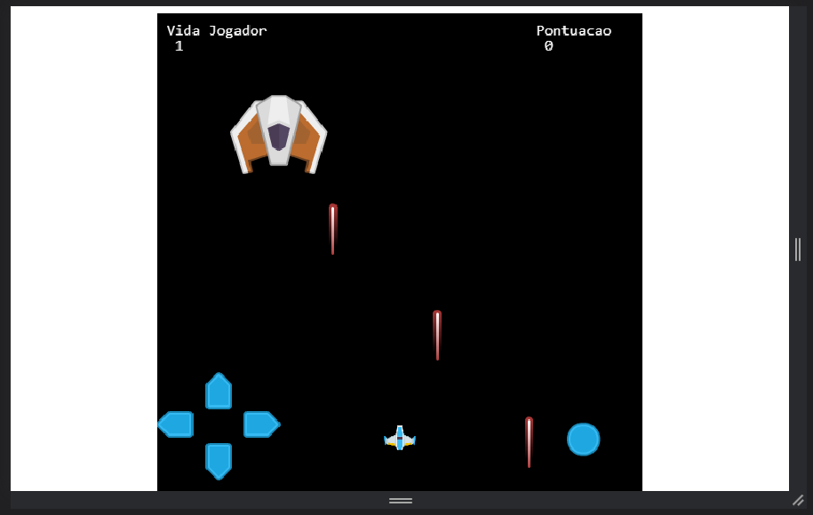
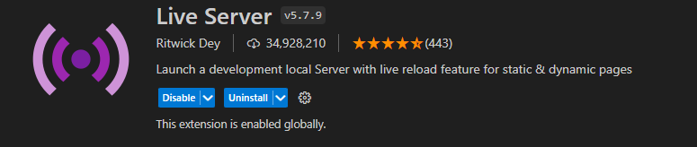

<h1 align="center"> Phaser Game </h1>

<p align="center">
 <a href="https://skillicons.dev">
   
     
   
   
  
  </a>
</p>

<h5 align="center">
  Create a game using phaser js and android studio
</h5>

<p align="center">
  
  
</p>


# Description:
<a> A mini game created using phaser js tools for the web version and using android studio to make its mobile version </a>

<p align="center">

</p>

<h6 align="center"> 
 The assets used in the project were taken from the website: https://kenney.nl/ 
</h6>

# Controls:
:arrow_left:  :arrow_up: :arrow_right: :arrow_down: <a>  -> Use the arrow keys to move </a>

<a> SPACE BAR </a> <a> -> Use the space bar to shoot </a>

# Load project in Web Server:

<a>Two ways using node js or the vs code extension called live server </a>

<h4 align="left"> - Node js </h4>
<h6> Download modules </h6>

```
> npm install
```

<h6> Start server </h6>

```
> node index.js
```

<h6> Go to the web page </h6>

```
> http://localhost:7070/
```

<h6> To close the server, use the command in your terminal</h6>

```
> CTRL + C
```

<h4 align="left"> - VS Code </h4>
<h6> To run directly in vscode you need the "Live Server" extension </h6>

<p align="left">

</p>

<h6> after having installed the extension look for the file "index.html", just follow the path below </h6>

```
> src\index.html
```

<h6> Right-click on the "index.html" file and look for the "Open with Live Server" option as shown in the image below </h6>

<p align="left">

</p>
